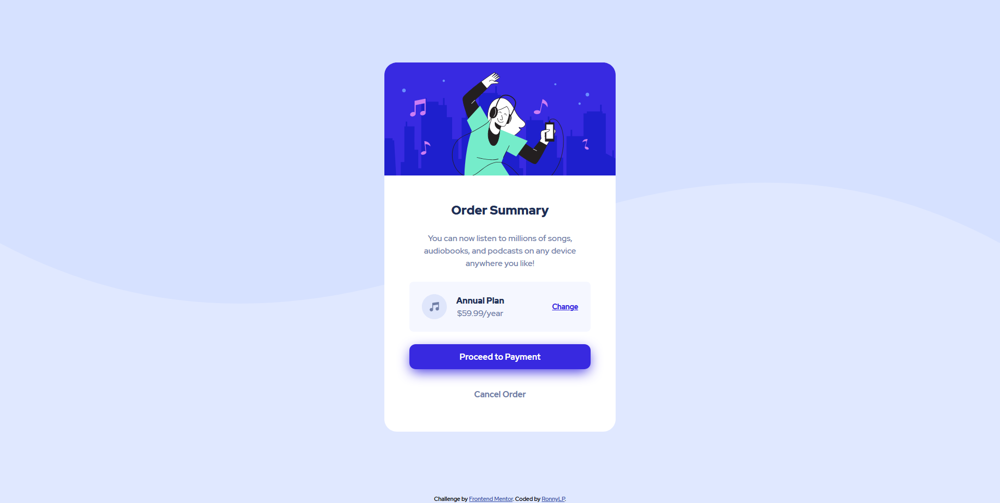

# Frontend Mentor - Order summary card solution



This is my solution to the [Order summary card challenge](https://www.frontendmentor.io/challenges/order-summary-component-QlPmajDUj) on [Frontend Mentor](//frontendmentor.io). 

## Table of contents

- [Overview](#overview)
  - [Requirements](#requirements)
  - [Links](#links)
- [My process](#my-process)
  - [Built with](#built-with)
  - [About the code](#about-the-code)
- [Author](#author)

## Overview

### Requirements

- Interaction with user input, in this case, with hover states.

- Being responsive

### Links

- Solution URL: [GitHub Repository](https://your-solution-url.com)
- Live Site URL: [Watch it live](https://ronnypumaricra.github.io/order-summary-component/)

## My process

### Built with

- HTML5
- CSS
- Basic Flexbox
- Mobile-first workflow

### About the code

As this is using a mobile-first approach, the CSS is written to fit the mobile version, and the media queries for little tweaks in the desktop version. It isn't a big deal, because the design doesn't change a lot.

```css
/* Example with .card-content */
.card-content {
  padding: 1.75rem 1.5rem;
}
@media screen and (min-width: 740px) {
  .card-content {
    padding: 3rem;
  }
}
```

Also used Flexbox for an easy centered component:
```css
body {
  height: 100vh;
  display: flex;
  flex-direction: column;
}
.card-component {
  margin: auto; /* Magic */
}
```

## Author

- Frontend Mentor - [@RonnyPumaricra](https://www.frontendmentor.io/profile/RonnyPumaricra)
